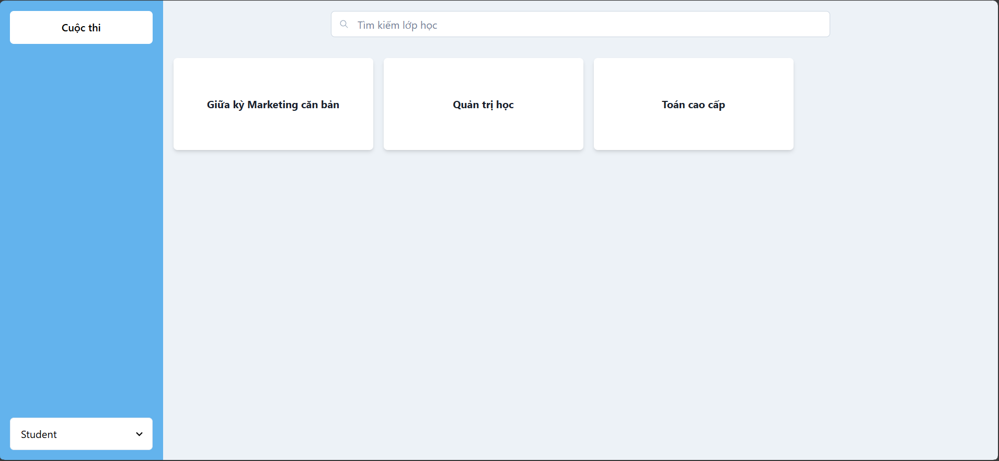
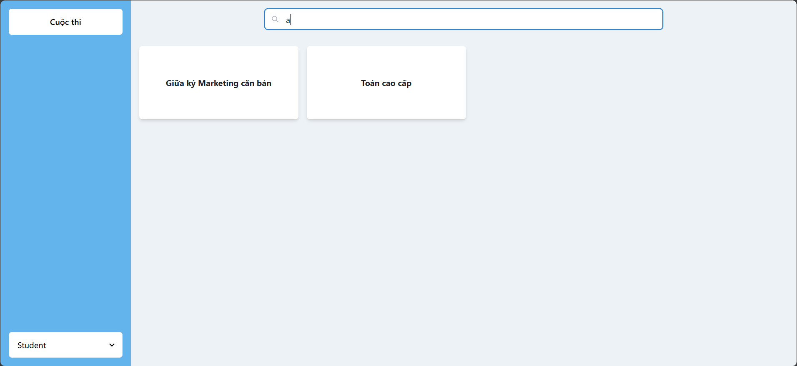
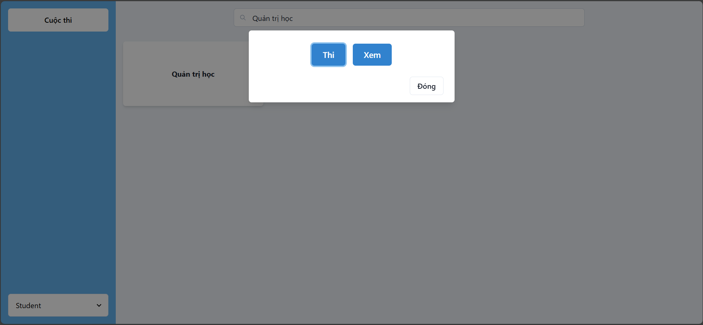
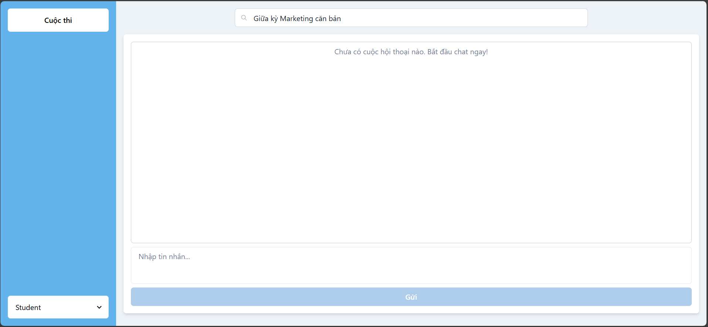
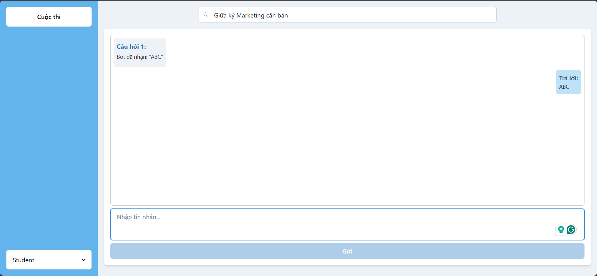
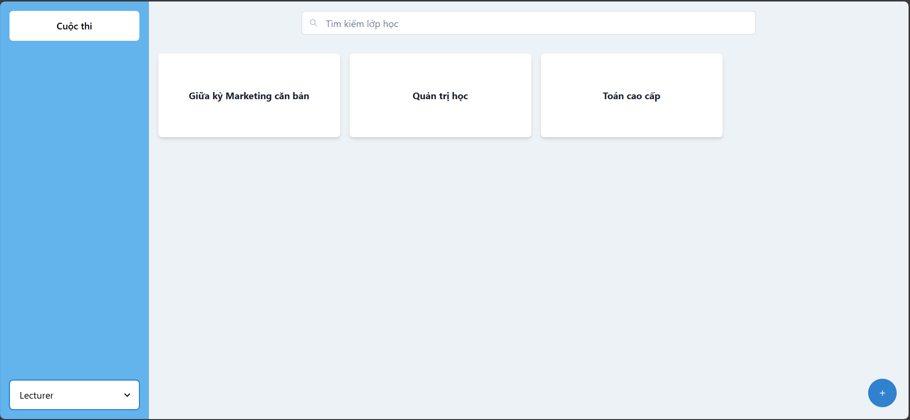
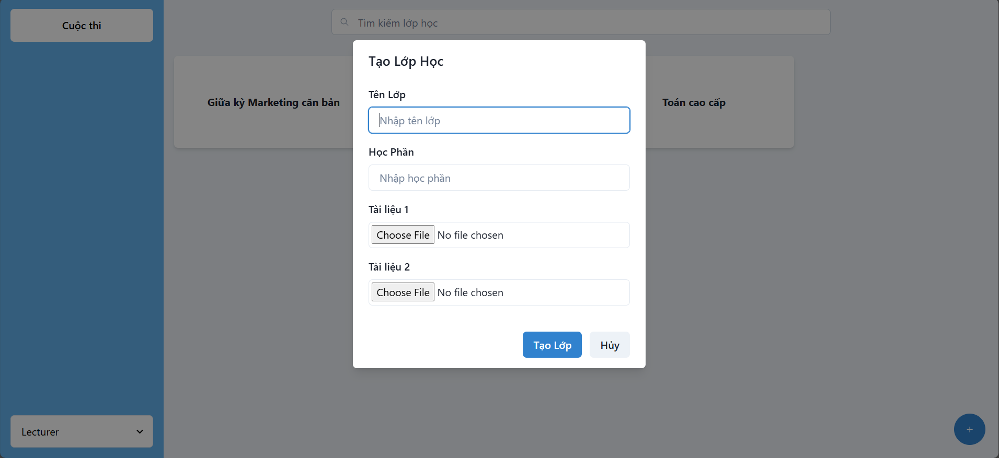
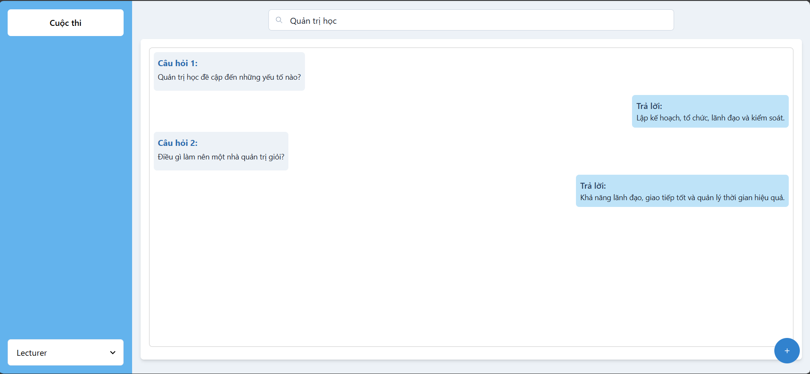

# NCKH - ChatBot

Build with Python(Flask) and JavaScript(React)

### Run the App Locally

1. Clone the repository:

```bash
git clone <link.git>
```

2. Install the dependencies:

```bash
npm install
```

3. Build the frontend:

```bash
npm run dev
```

<!-- ## Screenshots

### Student

<table width="100%">
  <tbody>
    <tr>
      <td width="1%"></td>
      <td width="1%"></td>
      <td width="1%"></td>
    </tr>
    <tr>
        <td width="1%"></td>
        <td width="1%"></td>
        <td width="1%"></td>
    </tr>
  </tbody>
</table>

### Lecturer

<table width="100%">
  <tbody>
    <tr>
      <td width="1%"></td>
      <td width="1%"></td>
    </tr>
    <tr>
        <td width="1%"></td>
        <td width="1%"></td>
    </tr>
  </tbody>
</table> -->

## Cấu trúc thư mục dự án

```
fe-AiEdu-assessment-platform/
├── src/
│   ├── lib/
│   │   ├── components/
│   │   │   ├── Layout/
│   │   │   │   ├── Layout.jsx
│   │   │   │   ├── Sidebar.jsx
│   │   │   ├── ExamBank/
│   │   │   │   ├── ExamBankDetail.jsx
│   │   │   │   ├── ExamBankForm.jsx
│   │   │   │   ├── ExamQuestion.jsx
│   │   │   │   ├── QuestionLevelBox.jsx
│   │   │   │   ├── QuestionDetail.jsx
│   ├── pages/
│   │   ├── ExamBank.jsx
│   │   ├── Class.jsx
│   │   ├── lib/
│   │   │   ├── router/
│   │   │   │   ├── browserRouter.jsx
│   │   │   ├── theme/
│   │   │   │   ├── index.js
│   │   │   ├── App.js
│   │   │   ├── index.js
│   │   │   └── ...
│   ├── public/
│   │   └── ...
│   ├── README.md
│   ├── package.json
│   └── ...
```

**Giải thích:**
- <code>src/pages/:</code></code> Chứa các trang chính của ứng dụng (ExamBank, Class, ...).
- <code>src/lib/components/:</code> Chứa các thành phần cho Page.
- <code>src/lib/router/:</code> Cấu hình router cho ứng dụng.
- <code>src/lib/theme/:</code> Cấu hình theme cho Chakra UI.