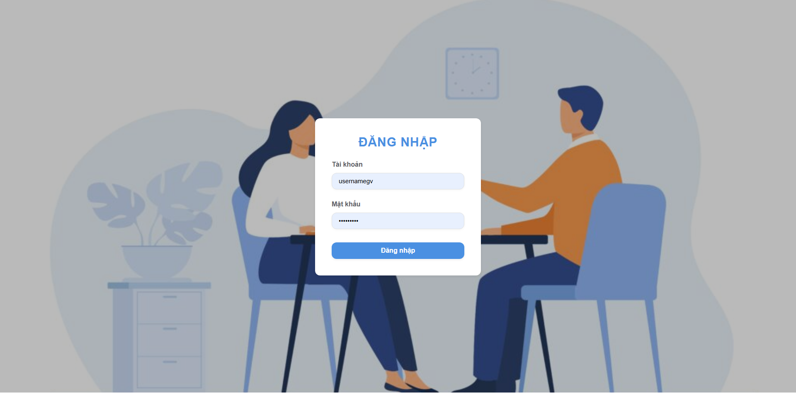

# AiEdu Assessment Platform - Nền tảng hỗ trợ thi vấn đáp thông minh

[](https://opensource.org/licenses/MIT)

## Mô tả
AiEdu Assessment Platform là một nền tảng hỗ trợ thi vấn đáp thông minh, được phát triển để tối ưu hóa quá trình đánh giá và kiểm tra vấn đáp trong môi trường giáo dục. Nền tảng này kết hợp sức mạnh của AI để tạo ra trải nghiệm thi cử hiệu quả và công bằng cho cả giảng viên và sinh viên.

### Tính năng chính
- Quản lý ngân hàng câu hỏi thông minh
- Hệ thống chấm điểm tự động
- Giao diện tương tác trực tiếp giữa giảng viên và sinh viên
- Phân tích và báo cáo kết quả chi tiết
- Hỗ trợ nhiều định dạng câu hỏi khác nhau

## Backend: 
💽[Hệ thống Chatbot Hỗ trợ Thi Vấn Đáp](https://github.com/heellworld/oral-exam-chatbot-.git)💽

## Giao diện
### GIẢNG VIÊN
<table width="100%">
  <tbody>
    <p>Quản lý Ngân hàng đề thi</p>
    <tr>
      <td width="1%"></td>
      <td width="1%"></td>
      <td width="1%"></td>
      <td width="1%"></td>
    </tr>
    <tr>
        <td width="1%"></td>
        <td width="1%"></td>
        <td width="1%"></td>
        <td width="1%"></td>
    </tr>
  </tbody>
</table> 
<table width="100%">
  <tbody>
    <p>Quản lý Lớp học phần</p>
    <tr>
        <td width="1%"></td>
        <td width="1%"></td>
        <td width="1%"></td>
    </tr>
  </tbody>
</table> 
<table width="100%">
  <tbody>
    <p>Quản lý Kỳ thi</p>
    <tr>
        <td width="1%"></td>
        <td width="1%"></td>
        <td width="1%"></td>
    </tr>
    <tr>
        <td width="1%"></td>
        <td width="1%"></td>
        <td width="1%"></td>
    </tr>
  </tbody>
</table>

### SINH VIÊN
<h4>Cuộc thi:</h4>
<table width="100%">
  <tbody>
    <p>Chế độ thi</p>
    <tr>
        <td width="1%"></td>
        <td width="1%"></td>
        <td width="1%"></td>
        <td width="1%"></td>
    </tr>
    <tr>
        <td width="1%"></td>
        <td width="1%"></td>
        <td width="1%"></td>
        <td width="1%"></td>
    </tr>
  </tbody>
</table> 
<table width="100%">
  <tbody>
    <p>Chế độ Luyện thi</p>
    <tr>
        <td width="1%"></td>
        <td width="1%"></td>
        <td width="1%"></td>
    </tr>
  </tbody>
</table>  
<!-- <table width="100%">
  <tbody>
    <p>Chế độ Luyện thi</p>
    <tr>
        <td width="1%"></td>
        <td width="1%"></td>
        <td width="1%"></td>
        <td width="1%"></td>
    </tr>
  </tbody>
</table>  -->

### Công nghệ sử dụng
- Frontend: React.js với Chakra UI

## Mục lục
- [Cài đặt](#cài-đặt)
- [Cách sử dụng](#cách-sử-dụng)
- [Cấu trúc dự án](#cấu-trúc-dự-án)
- [Đóng góp](#đóng-góp)
- [Giấy phép](#giấy-phép)

## Cài đặt

### Yêu cầu hệ thống
- Node.js (phiên bản 14.0.0 trở lên)
- npm hoặc yarn

### Các bước cài đặt

1. Clone repository:
```bash
git clone <link.git>
```

2. Cài đặt dependencies:
```bash
npm install
```

3. Khởi chạy frontend:
```bash
npm run dev
```

## Cách sử dụng

### Cho sinh viên
1. Đăng nhập vào hệ thống
2. Truy cập vào bài thi được gán
3. Thực hiện bài thi theo hướng dẫn
4. Xem kết quả và phản hồi
5. Luyện thi

### Cho giảng viên
1. Đăng nhập vào hệ thống
2. Tạo và quản lý ngân hàng câu hỏi
3. Tạo bài thi mới
4. Theo dõi và chấm điểm bài thi
5. Xem báo cáo và phân tích

## Cấu trúc dự án

```
fe-AiEdu-assessment-platform/
├── src/
│   ├── lib/
│   │   ├── components/     # Các component dùng chung
│   │   ├── config/        # Cấu hình ứng dụng
│   │   ├── hooks/         # Custom React hooks
│   │   ├── router/        # Cấu hình routing
│   │   ├── service/       # Các service gọi API
│   │   └── theme/         # Cấu hình theme Chakra UI
│   ├── pages/
│   │   ├── Student/       # Các trang dành cho sinh viên
│   │   ├── Lecturer/      # Các trang dành cho giảng viên
│   │   ├── LoginPage.jsx  # Trang đăng nhập
│   │   ├── HomePage.jsx   # Trang chủ
│   │   └── Error.jsx      # Trang xử lý lỗi
│   ├── asset/            # Thư mục chứa tài nguyên (images, icons, etc.)
│   ├── App.jsx           # Component gốc của ứng dụng
│   └── main.jsx          # Entry point của ứng dụng
```

**Giải thích:**
- `src/lib/`: Chứa các thư viện và utilities dùng chung
  - `components/`: Các component có thể tái sử dụng
  - `config/`: Cấu hình ứng dụng, constants, và các biến môi trường
  - `hooks/`: Custom React hooks
  - `router/`: Cấu hình routing và navigation
  - `service/`: Các service để gọi API và xử lý dữ liệu
  - `theme/`: Cấu hình theme và styling cho Chakra UI
- `src/pages/`: Chứa các trang chính của ứng dụng
  - `Student/`: Các trang dành cho sinh viên
  - `Lecturer/`: Các trang dành cho giảng viên
  - `LoginPage.jsx`: Trang đăng nhập
  - `HomePage.jsx`: Trang chủ
  - `Error.jsx`: Trang xử lý lỗi
- `src/asset/`: Chứa các tài nguyên tĩnh như hình ảnh, icons
- `App.jsx`: Component gốc của ứng dụng
- `main.jsx`: Entry point của ứng dụng React

## Đóng góp

### Người thực hiện dự án chung:

<p align="center">
  <a href="https://github.com/Doanh-Dinh-7">
    
  </a>
  <a href="https://github.com/heellworld">
    
  </a>
  <a href="https://github.com/qanngyen">
    
  </a>
  <a href="https://github.com/BaoPhuongPham">
    
  </a>
</p>

Chúng tôi rất hoan nghênh mọi đóng góp từ cộng đồng. Nếu bạn muốn đóng góp, vui lòng:

1. Fork repository
2. Tạo branch mới (`git checkout -b feature/AmazingFeature`)
3. Commit thay đổi (`git commit -m 'Add some AmazingFeature'`)
4. Push lên branch (`git push origin feature/AmazingFeature`)
5. Tạo Pull Request

## Giấy phép
Dự án này được cấp phép theo giấy phép MIT - xem file [LICENSE-MIT](LICENSE) để biết thêm chi tiết.
